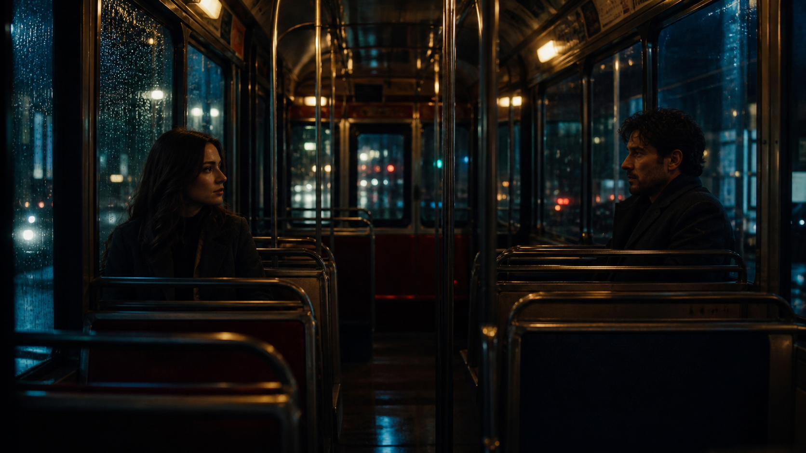
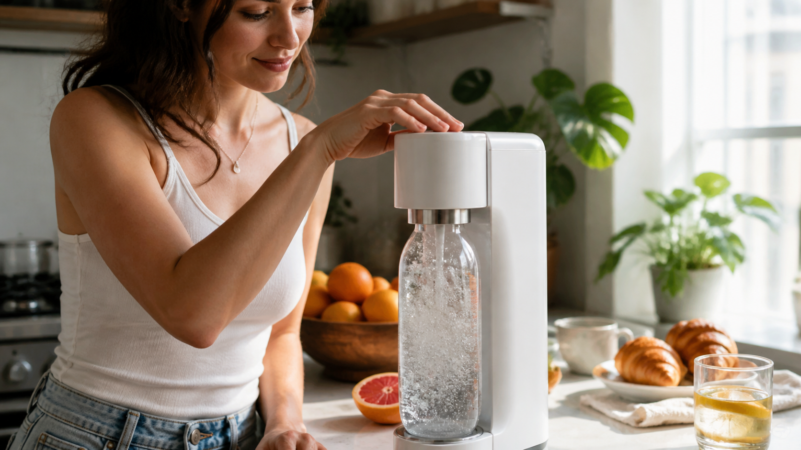
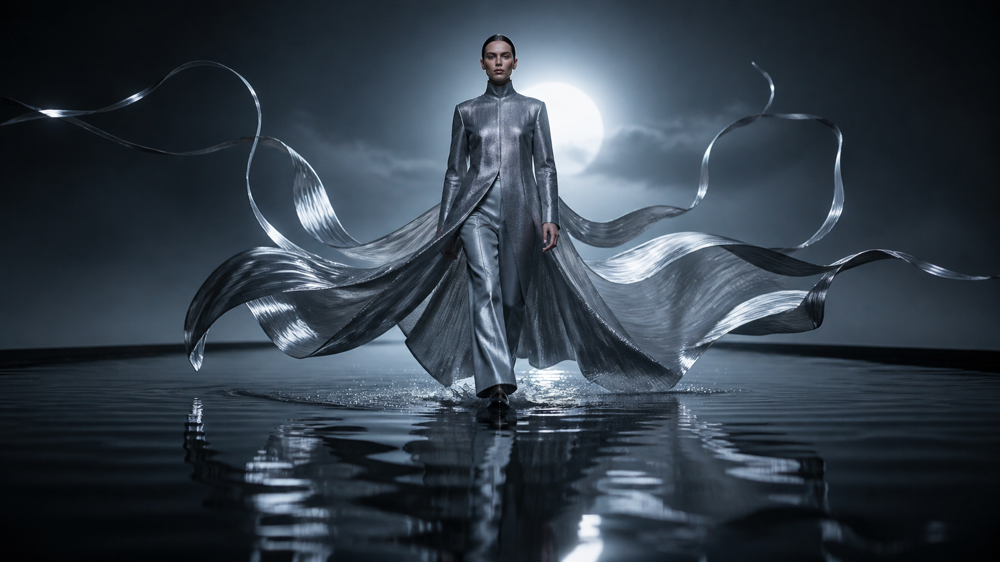
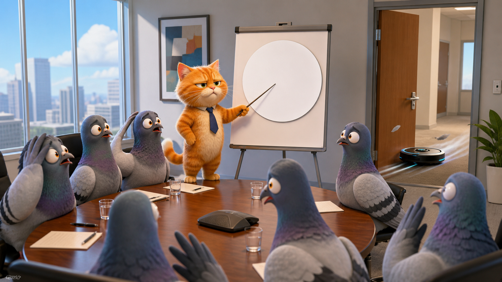
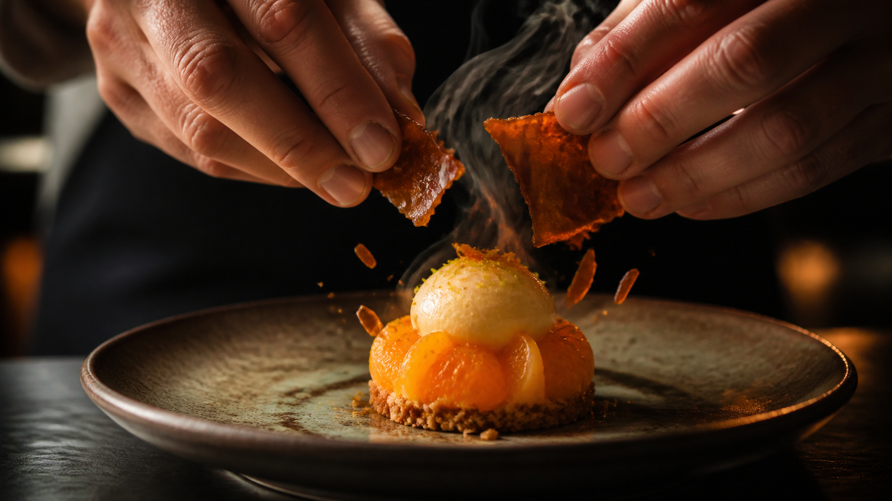
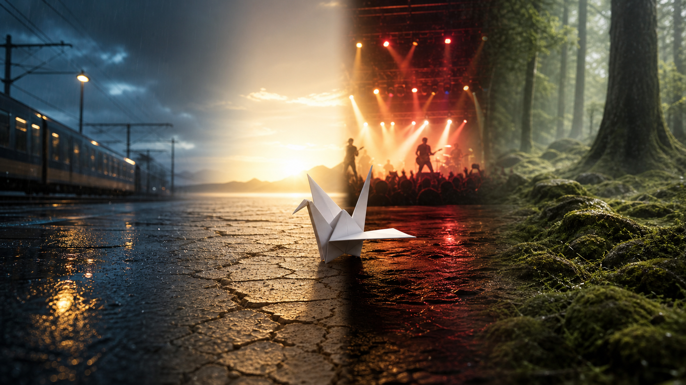
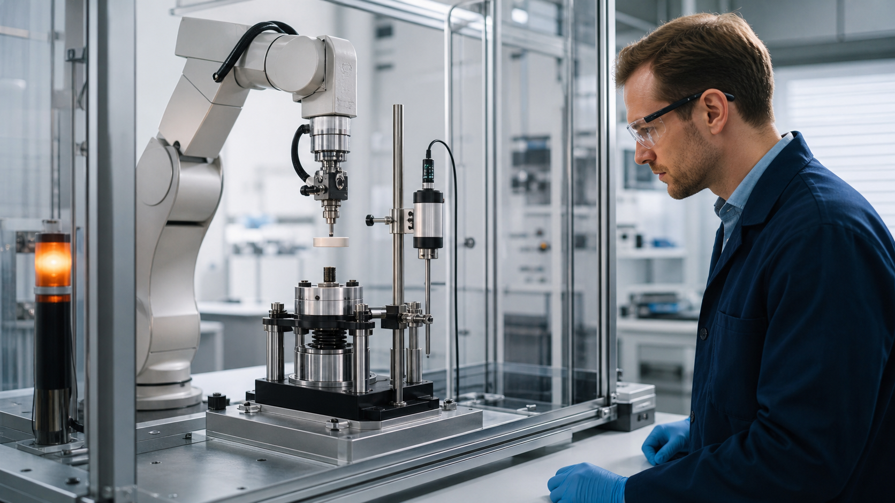

<div align="center">

# 🎬 Awesome Grok Imagine 1.5 Prompts

**60 original, production-ready Grok Imagine 1.5 video prompts for storytelling, ads, animation, creative editing, digital humans, education, science, nature, pets, and more.**

[](README.md)
[](README_zh-CN.md)
[](README_ja-JP.md)
[](README_es-ES.md)
[](README_ko-KR.md)
[](prompts/README.md)
[](CONTRIBUTING.md)
[](LICENSE)

### [Browse 60 prompts](prompts/README.md) · [Submit a prompt](https://github.com/seaimagine/awesome-grok-imagine-1-5-prompts/issues/new?template=prompt.yml) · [Use Grok Imagine 1.5 online](https://seaimagine.com/model/grok-imagine-1-5/)

Copy a prompt, replace the bracketed variables, add a reference image when useful, and generate.

</div>



## Why this collection

Short video models reward focus. A prompt that asks for five locations, three costume changes, two plot twists, and perfect dialogue in ten seconds usually produces visual drift. This collection is written around Grok Imagine Video 1.5's strengths: convincing motion and physics, synchronized sound effects and speech, fast image-to-video workflows, and clips up to 15 seconds.

The maintained core collection is newly written for this project, and every displayed image is newly generated for it. The examples use fictional people, products, places, and stories; no third-party prompt text, screenshots, or promotional assets are republished. Community submissions must be original or fully authorized, and contributor credit is optional.

## What is Grok Imagine 1.5?

`grok-imagine-video-1.5` is xAI's video generation model for text-to-video and image-guided creation. According to the official documentation, it supports 1–15 second clips, 480p/720p/1080p output, native sound effects, ambience and dialogue, plus image-to-video, reference-to-video, video editing, and video extension workflows. Reference-to-video currently tops out at 720p; video edits keep the source duration and are capped at 720p.

Useful official references:

- [Grok Imagine Video 1.5 announcement](https://x.ai/news/grok-imagine-video-1-5)
- [Imagine model overview](https://docs.x.ai/developers/model-capabilities/imagine)
- [Video generation and configuration](https://docs.x.ai/developers/model-capabilities/video/generation)
- [Model details and pricing](https://docs.x.ai/developers/models/grok-imagine-video-1.5)

> Model availability, limits, pricing, and product interfaces can change. Check the linked documentation before building a production workflow.

## Prompt library

| Collection | Best for | Prompts | Preview |
|---|---|---:|---|
| [Cinematic storytelling](prompts/cinematic-storytelling.md) | Drama, thriller, documentary, one-take scenes | 5 |  |
| [UGC & product ads](prompts/ugc-product-ads.md) | Creator ads, demos, unboxing, product hero shots | 5 |  |
| [Anime & stylized action](prompts/anime-stylized-action.md) | 2D action, stop motion, graphic animation | 5 |  |
| [Travel & lifestyle](prompts/travel-lifestyle.md) | Vlogs, city portraits, outdoor and wellness | 5 |  |
| [Fashion, beauty & food](prompts/fashion-beauty-food.md) | Editorial films, skincare, jewelry, ASMR food | 5 |  |
| [Fantasy & science fiction](prompts/fantasy-scifi.md) | Worldbuilding, creatures, mecha, surreal VFX | 5 |  |
| [Comedy, memes & social](prompts/comedy-memes-social.md) | Visual gags, mascots, loops, vertical shorts | 5 |  |
| [Sports, music & spaces](prompts/sports-music-architecture.md) | Sports ads, music video, real estate, interiors | 5 |  |
| [Creative editing & transitions](prompts/creative-editing-transitions.md) | Match cuts, reference transitions, edits, extensions | 5 |  |
| [Commerce, livestream & digital humans](prompts/commerce-digital-humans.md) | Livestream demos, multilingual presenters, honest product tests | 5 |  |
| [Education, science & industry](prompts/education-science-industry.md) | Visual explainers, physical processes, manufacturing workflows | 5 |  |
| [Nature, festivals & pets](prompts/nature-festivals-pets.md) | Seasonal stories, astronomy, animal-safe social content | 5 |  |

**Total: 60 original prompts across 12 practical collections** — each includes a recommended mode, duration, aspect ratio, a detailed copy-ready prompt, and variables to customize.

## Fast start

1. Open [Grok Imagine 1.5 online](https://seaimagine.com/model/grok-imagine-1-5/).
2. Pick a prompt from the library.
3. Replace placeholders such as `[PRODUCT]`, `[CITY]`, or `[DIALOGUE]`.
4. Choose an aspect ratio: `9:16` for Shorts/Reels/TikTok, `16:9` for YouTube and cinematic work, or `1:1` for feeds.
5. Start with one clear action in 6–10 seconds. Move to 12–15 seconds only when the timeline truly needs it.
6. For identity-sensitive work, create or upload a clean reference image, then describe motion rather than redescribing the entire frame.

## The Grok-ready prompt formula

```text
FORMAT — duration, aspect ratio, resolution target, visual medium.
SUBJECT LOCK — identity, clothing, product geometry, non-negotiable details.
SCENE — location, time, weather, background activity.
TIMELINE — 0–3s / 3–7s / 7–10s; one dominant action per beat.
CAMERA — framing, lens feel, movement, focus behavior, edit style.
MOTION & PHYSICS — weight, momentum, fabric, liquid, particles, collisions.
AUDIO — ambience, foley, music mood, exact dialogue and delivery.
CONTINUITY — what must remain unchanged across the clip.
AVOID — warping, extra limbs, floating objects, accidental text, logos, subtitles.
```

### Copy-ready starter template

```text
Create a [DURATION]-second [ASPECT RATIO] [STYLE] video.

SUBJECT LOCK: [Describe the person, creature, product, or vehicle once. State the details that must remain unchanged.]

SCENE: [Specific location], [time of day], [lighting], [weather/atmosphere].

TIMELINE:
0–[A]s — [Opening composition and one clear action].
[A]–[B]s — [Development; describe physical movement and camera response].
[B]–[END]s — [Payoff and a clean final frame suitable for a loop or end card].

CAMERA: [Shot size], [movement], [lens feel], [focus behavior]. Keep motion smooth and spatially coherent.

MOTION & PHYSICS: [Weight, momentum, secondary motion, material behavior]. Natural anatomy and contact with the ground.

AUDIO: [Ambient bed]. [Specific foley]. Optional exact dialogue: "[LINE]" delivered [tone], with natural lip sync. No background music unless specified.

CONTINUITY: Preserve face, hair, wardrobe, object count, product proportions, lighting direction, and screen direction throughout.

AVOID: identity drift, face morphing, extra fingers or limbs, rubbery motion, object duplication, geometry changes, flicker, random cuts, unreadable text, logos, watermark, subtitles.
```

## How to get better Grok Imagine 1.5 results

- **Give physics a verb.** “The coat moves” is vague; “the heavy wool hem lags half a beat behind each turn, then settles under gravity” is usable direction.
- **Separate voice from ambience.** Specify speaker, exact line, delivery, pause, room tone, and foley. Keep dialogue short enough to fit naturally.
- **Use camera movement with motivation.** Track a runner, push in on a realization, orbit a product reveal. Avoid stacking drone + dolly + whip pan + crash zoom in one beat.
- **Protect the last frame.** Ask for a steady 0.5–1 second hold when you need a thumbnail, product end card, or seamless edit point.
- **Lock reference-image invariants.** State “keep the exact silhouette, colors, button layout, label placement, and proportions” before describing motion.
- **Prefer clear cuts over impossible transformations.** If a transformation is essential, define the material transition, start state, end state, and what remains fixed.
- **Write dialogue in the spoken language.** Surrounding production instructions can be in another language; the quoted line should be exactly what the character says.

More detail: [Model-specific prompting guide](docs/PROMPTING-GUIDE.md) · [API examples](docs/API-GUIDE.md)

## Multilingual prompting

Grok Imagine can follow prompts written in multiple languages. For maximum control, keep technical labels consistent and write dialogue verbatim in the target language.

```text
[Camera / 镜头 / カメラ / Cámara / 카메라]
[Action / 动作 / アクション / Acción / 동작]
[Audio / 声音 / 音声 / Audio / 오디오]
[Continuity / 连贯性 / 一貫性 / Continuidad / 연속성]
```

Localized introductions and starter prompts:

- [简体中文](README_zh-CN.md)
- [日本語](README_ja-JP.md)
- [Español](README_es-ES.md)
- [한국어](README_ko-KR.md)

## Responsible use

- Obtain permission before using a real person's face, voice, likeness, private space, or personal media.
- Clearly disclose synthetic media where viewers could reasonably mistake it for real reporting, evidence, endorsements, or documentary footage.
- Avoid impersonation, non-consensual intimate content, fraud, harassment, and misleading political or medical claims.
- Use fictional brands and characters unless you have the rights needed for production and distribution.

## Contributing

Have a Grok Imagine 1.5 workflow that belongs here? Contributions in any language are welcome. You do not need to know Git:

- [Submit a prompt with the guided issue form](https://github.com/seaimagine/awesome-grok-imagine-1-5-prompts/issues/new?template=prompt.yml) — paste the prompt, settings, test notes, and optional preview media.
- [Open a pull request](https://github.com/seaimagine/awesome-grok-imagine-1-5-prompts/pulls) — best for adding a complete prompt file, translation, documentation improvement, or authorized visual asset.

We especially welcome tested workflows for underrepresented languages, accessibility, editing and extension, consistent products or characters, educational visualization, industrial processes, and culturally specific scenes written by people who know them well. Useful submissions explain the intended mode, duration, aspect ratio, why the structure works, and any known limitation.

Submissions are reviewed for originality, usefulness, model fit, safety, clarity, and publishing rights. Maintainers may restructure accepted prompts to match the library while preserving optional contributor credit. Read the full [contribution guide](CONTRIBUTING.md).

## License

Code and original written material in this repository are available under the [MIT License](LICENSE). Generated images may be subject to the terms of the generation service used to create them. You are responsible for checking model, platform, likeness, trademark, and distribution requirements for your own output.

---

<div align="center">

**Grok Imagine 1.5 prompts · AI video prompts · text to video · image to video · video editing · native audio**

[Start creating online](https://seaimagine.com/model/grok-imagine-1-5/) · [Browse all 60 prompts](prompts/README.md) · [Share your prompt](https://github.com/seaimagine/awesome-grok-imagine-1-5-prompts/issues/new?template=prompt.yml)

</div>
