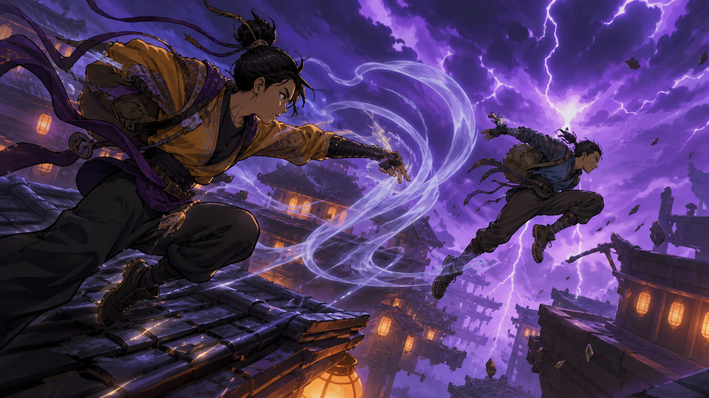

# 🎬 Grok Imagine 1.5 プロンプト集

Grok Imagine 1.5 向けに新規作成した、実用的な AI 動画プロンプト 40 本です。映画、UGC 広告、アニメ、旅行、ファッション、料理、SF、コメディ、スポーツ、音楽、建築を収録しています。

[English](README.md) · [简体中文](README_zh-CN.md) · **日本語** · [Español](README_es-ES.md) · [한국어](README_ko-KR.md)

## [✨ Grok Imagine 1.5 をオンラインで使う](https://seaimagine.com/model/grok-imagine-1-5/)



## 収録内容

- [映画・ストーリー](prompts/cinematic-storytelling.md)
- [UGC・商品広告](prompts/ugc-product-ads.md)
- [アニメ・スタイライズドアクション](prompts/anime-stylized-action.md)
- [旅行・ライフスタイル](prompts/travel-lifestyle.md)
- [ファッション・美容・料理](prompts/fashion-beauty-food.md)
- [ファンタジー・SF](prompts/fantasy-scifi.md)
- [コメディ・ミーム・SNS](prompts/comedy-memes-social.md)
- [スポーツ・音楽・建築](prompts/sports-music-architecture.md)

## 基本テンプレート

```text
[形式] 10秒、16:9、写実的な映画表現。
[主体固定] 人物の顔、髪型、衣装、色、持ち物、画面内の位置を最後まで維持する。
[場面] 場所、時間帯、天候、照明、背景の動き。
[タイムライン]
0–3秒：導入と一つの明確な動作。
3–7秒：動作の展開。重さ、慣性、接触点を具体的に描写。
7–10秒：結果。最後の1秒は安定したフレームを保持。
[カメラ] 画角、レンズ感、移動、フォーカス。
[音声] 環境音、効果音。台詞：「[台詞]」、[口調]、自然なリップシンク。
[連続性] 顔、衣装、物体数、形状、光の方向、移動方向を変えない。
[除外] 顔の変形、余分な指や手足、浮遊、複製、ちらつき、文字化け、ロゴ、字幕、透かし。
```

## 日本語サンプル：雨の路面電車

```text
10秒、16:9、写実的で抑制された現代ドラマ。深夜の空いた路面電車。架空の成人二人が通路の左右に座る。顔、濃紺と灰色の服、座席位置を固定。

0–3秒：雨粒の付いた窓の反射越しに二人が互いに気づく。車体の揺れに合わせて身体と重いコートがわずかに動く。
3–7秒：40mm レンズ感のゆっくりしたプッシュイン。左の乗客が小声で「長い一日でしたね」と言う。自然で控えめな口の動き。
7–10秒：右の乗客にフォーカスを送り、疲れた微笑みと小さなうなずき。最後の視線を1秒保持。

音声：車輪の低音、窓を打つ雨、遠いベル。音楽なし。顔の変形、座席の変化、乗客の追加、字幕、ロゴ、透かしを避ける。
```

モデルの仕様は変更される場合があります。[xAI 公式ドキュメント](https://docs.x.ai/developers/model-capabilities/video/generation)も確認してください。

[40 本のプロンプトを見る](prompts/README.md) · [メインガイドへ](README.md)
