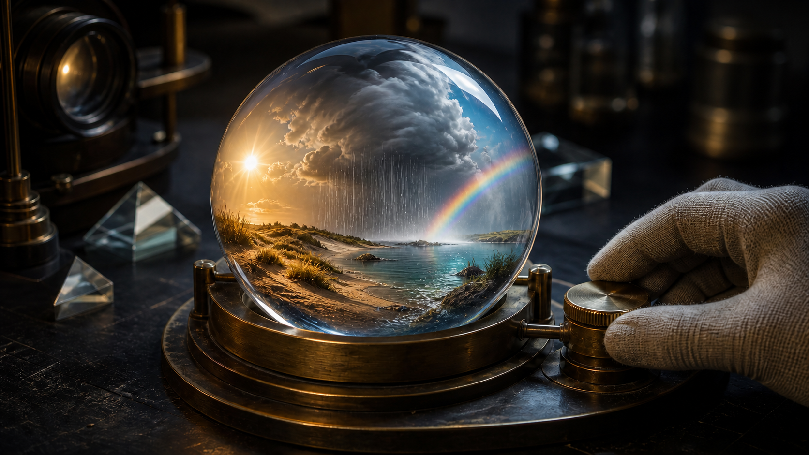

# Experimental VFX and Physics Prompts for Grok Imagine 1.5



These prompts turn surreal ideas into controlled visual systems. Each one defines a stable anchor, a single transformation rule, material behavior, sound response, and an unambiguous final state so experimentation does not become random morphing.

## 1. Weather in a Glass Sphere — contained-world macro effect

**Mode:** Image-to-video recommended · **Duration:** 12s · **Aspect ratio:** 16:9 · **Audio:** miniature weather + mechanism

```text
Animate the supplied optical-workshop reference. Preserve one clear glass sphere, the miniature coastal landscape fully contained inside it, circular brass cradle, one blank mechanical dial, one gloved right hand, dark worktable, prisms, camera angle, and warm-cool lighting. No additional sphere may appear.

0–3s — macro view. Inside the sphere, late-afternoon sun lights dry miniature dunes on the left while the sea on the right remains calm. Outside objects and the glove stay still.
3–7s — the gloved hand rotates the dial clockwise by exactly one quarter-turn. A compact cloud travels only inside the sphere from left to center; fine rain begins beneath it and darkens a narrow strip of sand. Reflections on the outer glass remain optically coherent.
7–10s — cloud continues right, rain stops over the dunes, and a restrained rainbow forms in mist above the miniature water. Wet sand reflects the brighter sky.
10–12s — hand releases the dial. All weather motion settles into a balanced final tableau while one last droplet runs down the inside surface, not the outside glass.

CAMERA: Locked low macro three-quarter view, slow 5-percent push only; do not orbit or reframe.

PHYSICS & OPTICS: Sphere stays grounded, brass mechanism does not deform, cloud and rain remain inside, glass refraction and highlights respond consistently, water volume stays contained.

AUDIO: Dial detent, tiny distant thunder, fine rain, gentle miniature surf, workshop room tone. No narration or music.

AVOID: extra sphere, floating globe, cracked glass, full-size storm outside, landscape escaping, labels, numbers, logo, subtitles, watermark.
```

## 2. The Gravity Hinge Room — one-axis physical inversion

**Mode:** Text-to-video · **Duration:** 15s · **Aspect ratio:** 16:9 · **Audio:** room foley

```text
Create a 15-second photorealistic practical-effects sequence in a plain furnished room mounted conceptually on one hidden horizontal hinge. One fictional adult in a mustard jumpsuit stands at center. The room contains one bolted table, one bolted chair, one loose red rubber ball, and one hanging pendant lamp. Walls have no doors, windows, text, or artwork.

0–4s — wide locked frame. Person releases the red ball from waist height; it drops normally, bounces once, and settles near their right boot.
4–9s — the entire room and camera rotate together 90 degrees clockwise around the fixed horizontal axis, slowly enough to follow. Bolted furniture stays attached. Person braces safely against the floor as it becomes a wall; the loose ball rolls along the changing gravity direction.
9–13s — rotation stops. The former right wall is now the floor. Person takes one careful grounded step onto it while the pendant swings toward the new down direction and the ball rolls to the same surface.
13–15s — all secondary motion decays. Person catches the ball with one hand after a small final bounce and looks up at the sideways lamp.

CAMERA: Symmetrical 24mm view mechanically locked to the rotating room; one unbroken shot, straight lines, no horizon correction.

PHYSICS: Gravity remains world-down while the set rotates. Body weight, ball, loose fabric, and pendant must all agree. Furniture bolts and room geometry remain rigid.

AUDIO: Set motor, shoe friction, rolling rubber, lamp chain, one catch. No dialogue or music.

AVOID: zero gravity, floating person, rotating individual props independently, missing contact points, rubber walls, teleportation, extra furniture, text, logo, watermark.
```

## 3. The Shadow Takes a Detour — controlled surreal choreography

**Mode:** Image-to-video recommended · **Duration:** 10s · **Aspect ratio:** 4:3 · **Audio:** footsteps + light buzz

```text
Animate the supplied 4:3 reference of one fictional adult walking left to right past a long cream wall under a single bright overhead lamp. Preserve the person's identity, beige coat, walking speed, wall, lamp, floor seam, camera, and hard-edged shadow style.

0–3s — person walks steadily right; their shadow follows normally on the wall with matching limbs and contact at the feet.
3–6s — as the person passes a narrow vertical pillar, the shadow alone continues around the far side of the pillar instead of crossing it. The real person remains on the near side and does not react yet. Shadow motion still matches the person's gait.
6–8s — shadow emerges two meters ahead on the same wall, stops, and turns its head back while the real person takes one more step.
8–10s — person notices, stops, and slowly looks toward the shadow. The shadow raises one open hand; the real person keeps both hands down. Hold the mismatch for one second.

CAMERA: Locked lateral composition, no cut, zoom, pan, or exposure change.

RULES: Until 6 seconds, shadow anatomy and cadence match exactly. After separation, it remains a flat light-occlusion shape on the wall—never a solid creature. The real body stays physically ordinary.

AUDIO: Measured footsteps, coat movement, faint lamp buzz. Footsteps stop with the person; no sound comes from the shadow. No score.

AVOID: duplicate physical person, horror face, shadow leaving the wall, extra limbs, changing light direction, flicker, text, logo, watermark.
```

## 4. Ferrofluid Choir — sound-reactive material study

**Mode:** Text-to-video · **Duration:** 12s · **Aspect ratio:** 1:1 · **Audio:** original vocal tones

```text
Create a 12-second square macro material experiment on a clean black laboratory table. A shallow circular glass dish contains a small amount of glossy black ferrofluid above hidden controllable magnets. No people are visible. Use one continuous camera view and no labels.

0–3s — one low original vocal tone begins. Ferrofluid gathers from a flat pool into one stable central cone with fine radial spikes; the glass dish remains stationary.
3–6s — a second higher voice joins in harmony. Two smaller symmetric cones rise beside the first, their spike density increasing with pitch while total liquid volume remains constant.
6–9s — voices perform a slow three-note chord change. Cones lean in sequence left, center, right without breaking into droplets; surface reflections travel smoothly across them.
9–12s — voices resolve to one soft unison note. All three cones merge gradually back into one rounded central form, then relax into a flat pool as the sound fades.

CAMERA: 90mm macro, fixed 30-degree overhead angle, deep enough focus to show the dish edge and fluid contact.

PHYSICS: Ferrofluid remains inside the dish, magnetic peaks respond continuously rather than teleporting, no loss or duplication of liquid, surface tension stays believable.

AUDIO: Original wordless three-voice tones only, clean studio decay, subtle glass resonance. Shape changes align precisely to pitch entries and releases.

AVOID: recognizable melody, lyrics, speaker UI, liquid splashes, solid metal spikes, smoke, hands, readable measurement marks, logo, watermark.
```

## 5. Paper City Drinks the Rain — material-state transformation

**Mode:** Reference-to-video recommended · **Duration:** 14s · **Aspect ratio:** 16:9 · **Audio:** rain + paper foley

```text
Use the reference image to preserve an original tabletop city made entirely from unprinted white paper: seven simple buildings, one arched bridge, one narrow street, and one folded tree. Keep the exact model layout, camera angle, object count, and neutral studio background.

0–4s — light rain begins from above. Droplets darken the paper locally and bead along roof folds; buildings remain upright and the tabletop stays visible.
4–8s — wet fibers at the street edges soften and unfold into shallow white paper channels. Rainwater follows these channels downhill beneath the bridge. Transformation advances only where water has touched.
8–11s — the folded tree absorbs water, slowly opens into layered paper leaves, and guides droplets from leaf tips into the nearest channel. Buildings remain unchanged except for realistic damp edges.
11–14s — rain stops. Camera makes a small push toward the now-connected channel network as water drains to one circular paper reservoir at the city edge. Hold the intact city for one second.

CAMERA: Stable 50mm tabletop macro with a single slow push during the last three seconds. No aerial transition or cut.

MATERIAL RULE: Everything except water remains visibly fibrous, foldable white paper. No plastic, stone, metal, printed windows, or organic plant texture appears. Paper does not dissolve or collapse.

AUDIO: Fine rain on paper and table, fiber creaks, small water trickle, quiet studio. No voice or music.

AVOID: flooded buildings, random origami animals, added structures, readable print, color changes, melting paper, impossible uphill flow, logo, watermark.
```

[Use Grok Imagine 1.5 online](https://seaimagine.com/model/grok-imagine-1-5/) · [Prompt index](README.md)
