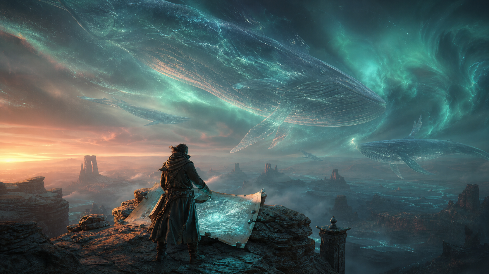

# Fantasy and Science-Fiction Prompts for Grok Imagine 1.5



## 1. Cartographer of the Sky Whales

**Mode:** Image-to-video recommended · **Duration:** 12s · **Aspect ratio:** 16:9 · **Audio:** atmospheric

```text
Animate the supplied science-fantasy reference into a 12-second discovery scene. Preserve the fictional adult cartographer, dark layered coat, luminous physical map, rock plateau, copper sunset at left, teal aurora at right, and every sky-whale design and scale.

0–4s — wide locked composition; the nearest transparent sky whale glides slowly overhead from left to right, its fins moving with massive underwater-like inertia while aurora light refracts through its body. 4–8s — the cartographer places one gloved hand on the map; lines on the map brighten in response and the camera begins a slow push. 8–12s — a distant whale answers with a low call; the cartographer looks up as fine dust lifts from the plateau in the downdraft, coat hem trailing toward the right. Hold on the scale contrast.

CAMERA: Epic 32mm cinema frame, slow push only, no cuts or orbit.

PHYSICS: Creatures move with enormous mass; fins lag and settle; dust and clothing share wind direction; map remains anchored by four weights.

AUDIO: Deep resonant whale-like call, high-altitude wind, map material hum, small stones shifting. No dialogue or score.

AVOID: creature duplication, fast swimming, changing map symbols, costume drift, famous franchise design, text, logo, watermark.
```

## 2. The Drowned Library — underwater exploration

**Mode:** Text-to-video · **Duration:** 10s · **Aspect ratio:** 16:9 · **Audio:** underwater sound design

```text
Create a 10-second photoreal science-fantasy dive inside a vast submerged circular library. A fictional adult diver wears a practical cream pressure suit, brass shoulder lamps, clear round helmet, and a small blue oxygen pack. Preserve all suit details.

0–3s — wide shot as the diver swims through a broken arch; hundreds of closed stone book boxes line the walls, and one school of silver fish parts around the diver. 3–7s — camera follows from behind as the diver approaches a central floating stone sphere engraved with abstract non-linguistic grooves; shoulder lamps reveal drifting silt. 7–10s — the diver touches the sphere with one glove; the grooves emit a gentle blue light and nearby book boxes rotate a few degrees open without releasing pages.

CAMERA: Slow buoyant tracking, 28mm wide lens, stable horizon, no fast cuts.

PHYSICS: Bubbles rise, silt reacts to fin movement, body remains neutrally buoyant, suit fabric moves slowly, objects have underwater drag.

AUDIO: Muffled breathing, suit creaks, distant low water pressure, subtle mineral resonance on touch. No spoken dialogue.

AVOID: flooding transition, sharks, horror, readable alphabet, loose paper surviving underwater, extra limbs, copyrighted design, watermark.
```

## 3. Glasswood Lightning — controlled magical physics

**Mode:** Text-to-video · **Duration:** 9s · **Aspect ratio:** 9:16 · **Audio:** storm foley

```text
Create a 9-second vertical fantasy nature film in a forest of translucent glass-like trees. A fictional adult field researcher in a dark green weather cloak carries one copper grounding staff. The forest is beautiful, not threatening.

0–3s — low shot follows boots across wet black soil while clear roots glow faintly beneath the surface; wind makes glass leaves chime softly. 3–6s — the researcher plants the copper staff firmly; a single cloud-to-ground lightning bolt strikes the staff, travels visibly into the root network, and illuminates the trees in a spreading amber wave. 6–9s — the light fades gradually; tiny fractures in one nearby leaf heal by flowing back together, and the researcher records the result on a blank slate.

CAMERA: Ground-level track to medium reveal, one continuous movement, exposure handles lightning without full whiteout.

PHYSICS: Lightning follows the conductor, roots illuminate outward with delay, cloak and leaves share wind direction, glass does not explode.

AUDIO: Wind, glass leaf chimes, thunder after the flash, deep electrical hum through soil, one healing glass tone.

AVOID: repeated lightning, injury, fire, weapon use, unreadable anatomy, written symbols, logos, watermark.
```

## 4. Lunar Greenhouse Dawn — optimistic hard science fiction

**Mode:** Text-to-video · **Duration:** 12s · **Aspect ratio:** 16:9 · **Audio:** habitat ambience + dialogue

```text
Create a 12-second optimistic hard-science-fiction scene inside a lunar greenhouse. A fictional adult botanist wears a practical soft gray habitat suit with green piping, no helmet, and checks a row of red-leaf dwarf plants under glass. Earth is small and consistent beyond the reinforced window.

0–4s — medium tracking shot as the botanist moves along the sealed hydroponic channel, checking one leaf with a sensor wand. 4–8s — automated shades retract smoothly; low sunlight crosses the greenhouse, plants orient only slightly toward it, and fine condensation glows on the glass. 8–12s — close profile as the sensor turns green; the botanist smiles and says into a collar microphone, "First natural-light cycle is stable." Earth remains in background.

CAMERA: Restrained 40mm production design shot, slow lateral track, clean focus pull, no exterior cut.

PHYSICS: Low-gravity influence is subtle in loose fabric and droplets; feet remain magnetically grounded; plants do not grow in time lapse.

AUDIO: Ventilation, pumps, shade motor, faint electronics, clear collar-mic dialogue. No music.

AVOID: floating astronaut, giant Earth, instant plant growth, impossible open windows, brand insignia, UI text, watermark.
```

## 5. The Gravity Foundry — industrial VFX sequence

**Mode:** Text-to-video · **Duration:** 15s · **Aspect ratio:** 21:9 · **Audio:** machinery

```text
Create a 15-second ultra-wide industrial science-fiction sequence in an original orbital foundry. Three identical robotic arms guide a glowing ring of molten metal inside a magnetic chamber; one fictional adult engineer watches behind thick safety glass in a white thermal suit.

0–5s — wide establishing shot: the molten ring rotates horizontally, held in place by six blue magnetic nodes; robotic arms move in synchronized small corrections. 5–10s — camera moves closer to the safety glass as one node flickers; the ring tilts five degrees, the engineer pulls one physical lever, and the backup node activates before any spill. 10–15s — the ring returns level, cools from orange to dark silver in a controlled radial pattern, and settles onto a ceramic platform; the engineer releases a breath.

CAMERA: One slow dolly, 35mm anamorphic feel, glass reflections controlled, no shaky emergency coverage.

PHYSICS: Molten metal has mass and surface tension; magnetic correction is gradual; robotic arms keep fixed joint structure; cooling changes emissive color logically.

AUDIO: Deep machinery, electrical pulse, brief alarm, lever clunk, cooling metal ticks. No dialogue or music.

AVOID: explosions, injury, liquid floating through glass, extra arms, interface text, recognizable franchise imagery, logos, watermark.
```

[Use Grok Imagine 1.5 online](https://seaimagine.com/model/grok-imagine-1-5/) · [Prompt index](README.md)
