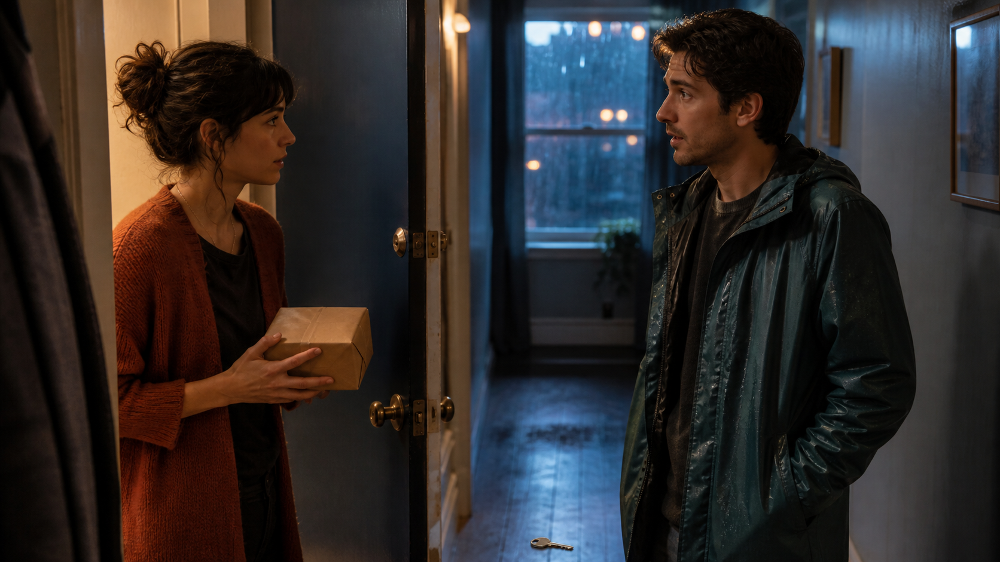

# Short-Form Drama and Web-Series Prompts for Grok Imagine 1.5



These prompts are built around one location, two or fewer speaking characters, a readable emotional turn, and a final hook. They keep dialogue short enough for natural delivery inside Grok Imagine 1.5's 15-second limit.

## 1. The Wrong Parcel — apartment-door mystery hook

**Mode:** Image-to-video recommended · **Duration:** 12s · **Aspect ratio:** 9:16 · **Audio:** rain + restrained dialogue

```text
Animate the supplied vertical apartment-hallway reference into episode one of an original contemporary mystery. Preserve the two fictional adults, the resident's rust cardigan, the visitor's dark teal raincoat, the half-open door, one blank kraft-paper parcel, one brass key on the floor, hallway layout, and warm-cool lighting.

0–3s — resident holds the parcel at chest height and says, "This has my apartment number, but not my name." The visitor keeps both hands visible and glances from the blank parcel to the floor.
3–7s — visitor points toward the brass key without stepping closer and quietly says, "That key was inside when I found it." Camera tilts just enough to reveal the key between them.
7–10s — resident looks back into the apartment. A second door latch is heard moving off screen, but the visible door and both characters remain still.
10–12s — close on the resident's controlled reaction as they whisper, "I live alone." Cut to black after a half-second hold.

CAMERA: Believable vertical streaming-drama coverage; medium two-shot, motivated tilt, then close reaction. Maintain the same eye line and 180-degree screen direction.

AUDIO: Distant rain, wet coat movement, parcel paper, quiet latch from inside, exact dialogue with natural lip sync. No music or jump-scare sting.

CONTINUITY: One parcel, one loose key, unchanged clothing and doorway. The visitor remains outside and non-threatening.

AVOID: readable shipping label, weapon, forced entry, extra resident appearing, melodramatic screaming, face drift, random cuts, subtitles, logo, watermark.
```

## 2. Floor Zero — contained elevator cliffhanger

**Mode:** Text-to-video · **Duration:** 15s · **Aspect ratio:** 9:16 · **Audio:** elevator foley + dialogue

```text
Create a 15-second vertical mystery-drama scene inside a clean, ordinary apartment elevator. Two fictional adult neighbors ride together: Character A wears a camel coat and holds one grocery bag; Character B wears a navy work jacket and carries nothing. The control panel has blank illuminated shapes with no readable numbers.

0–4s — locked medium two-shot. Elevator descends normally; grocery items shift with the car's gentle deceleration. Character A asks, "Did you press the basement?" Character B looks at the untouched panel and answers, "There isn't one."
4–8s — the car stops with a soft mechanical thud. All panel lights turn off except one plain circular light at the bottom. Neither character touches it.
8–12s — doors open only 20 centimeters onto darkness. A warm breeze moves the top of the grocery bag inward, against the elevator ventilation. Character B presses the door-close button once, but nothing happens.
12–15s — from the gap, an unseen calm voice says, "Right on time." Both characters exchange one restrained look; cut before either moves.

CAMERA: One continuous chest-height 35mm shot with a slow push beginning only after the stop. No hallway reveal and no camera crossing the door gap.

PHYSICS: Elevator motion changes body balance subtly, doors remain on their tracks, bag contents respond to acceleration and breeze.

AUDIO: Cable hum, brake, door motor, bag rustle, exact dialogue. The unseen voice is clear and neutral, not monstrous. No music.

AVOID: readable floor numbers, horror creature, flashing red alarm, violent door motion, teleportation, extra passengers, face changes, captions, logo, watermark.
```

## 3. The Last Audition Chair — emotional reversal

**Mode:** Reference-to-video recommended · **Duration:** 13s · **Aspect ratio:** 16:9 · **Audio:** dialogue + rehearsal-room ambience

```text
Use the character references only to preserve two fictional adult performers: Performer A in a faded green overshirt and Performer B in a charcoal sweater. Create a 13-second grounded drama in a nearly empty community rehearsal room with six plain chairs and no signage.

0–4s — Performer A enters late, sees Performer B stacking the last chairs, and says while catching their breath, "I missed it, didn't I?" Keep the doorway and six-chair count visible.
4–8s — Performer B pauses, places one chair back at center, and replies, "The audition ended. The understudy read hasn't." Their delivery is practical, not sentimental.
8–11s — Performer A absorbs the offer, sets a worn script with blank pages on the chair, and gives one small nod. Performer B steps to a simple tape mark opposite.
11–13s — Performer B says, "From the top." Both take a steadying breath as the room lights dim slightly into rehearsal mode; hold before the performance begins.

CAMERA: Start wide at doorway, cut once to an even two-shot, then a restrained push toward the chair. Preserve stage left/right positions.

AUDIO: Fluorescent room tone, chair legs on wood, footsteps, breathing, exact dialogue with natural pauses. No score or applause.

CONTINUITY: Same two people, six chairs, one blank script, wardrobe, room geometry, and screen direction throughout.

AVOID: instant tears, romantic framing, audience appearing, readable pages, costume change, exaggerated spotlight, subtitles, logos, watermark.
```

## 4. A Voice Note from Tomorrow — speculative phone drama

**Mode:** Text-to-video · **Duration:** 15s · **Aspect ratio:** 9:16 · **Audio:** phone playback + room tone

```text
Create a 15-second vertical speculative micro-drama in a small kitchen just before sunrise. One fictional adult in a gray T-shirt sits alone at the table beside a plain phone, one untouched glass of water, and a ceramic bowl. The phone screen is out of focus and contains no readable interface.

0–4s — the phone vibrates once. The character taps play and hears their own voice, slightly older and tired: "When the kettle clicks, don't open the window." Their expression moves from annoyance to attention.
4–8s — behind them, an electric kettle reaches temperature and clicks off exactly once. The character freezes; the camera racks focus from their face to the closed window.
8–12s — three soft knocks sound on the outside of the fourth-floor window. The curtain moves inward even though the latch remains visibly closed.
12–15s — character brings the phone close and whispers, "What happens if I already did?" The same recorded voice answers immediately, "Then don't turn around." Cut to black before any turn.

CAMERA: One stable 50mm composition with two controlled focus pulls and a very slow push. No view outside and no reveal behind the character.

AUDIO: Refrigerator hum, phone vibration, realistic kettle click, exact two versions of the same voice, three window knocks. No music.

CONTINUITY: One person on screen, one phone, closed window and latch, constant dawn light, unchanged prop placement.

AVOID: readable notification text, duplicate person, visible monster, shattered glass, levitating props, screaming, identity drift, subtitles, logo, watermark.
```

## 5. The Repair Ticket — family reveal without exposition

**Mode:** Image-to-video recommended · **Duration:** 14s · **Aspect ratio:** 16:9 · **Audio:** workshop foley + bilingual dialogue

```text
Animate the supplied small electronics-repair-shop reference. Preserve the same fictional middle-aged technician, fictional adult customer, olive work apron, blue overshirt, old portable radio with no brand, blank paper repair ticket, bench tools, and afternoon window light.

0–4s — technician turns the repaired radio dial; soft static resolves into a short original piano phrase. The customer recognizes it and asks in Mandarin, "这段旋律，你从哪里听来的？" Keep delivery quiet and natural.
4–8s — technician stops turning the dial, looks at the blank repair ticket, and replies in English, "The person who brought it in used to hum it." The radio remains on the bench.
8–11s — customer places one faded, text-free family photograph face down beside the radio and asks in English, "When?"
11–14s — technician looks at the photo's blank back and answers in Mandarin, "每年，今天。" The piano phrase ends on one unresolved note; hold on both characters understanding more than they say.

CAMERA: Intimate 50mm two-shot, one insert of hand, blank photo back, and radio, then return to the same axis. No flashback.

AUDIO: Tool-shop room tone, radio dial friction, light static, original three-note piano phrase, exact bilingual dialogue with the same character voices and natural pronunciation.

CONTINUITY: Radio geometry, prop count, wardrobe, hands, bench layout, and light direction do not change.

AVOID: readable ticket or photo writing, famous song, voice cloning, brand label, sudden crying, age morph, subtitles, watermark.
```

[Use Grok Imagine 1.5 online](https://seaimagine.com/model/grok-imagine-1-5/) · [Prompt index](README.md)
