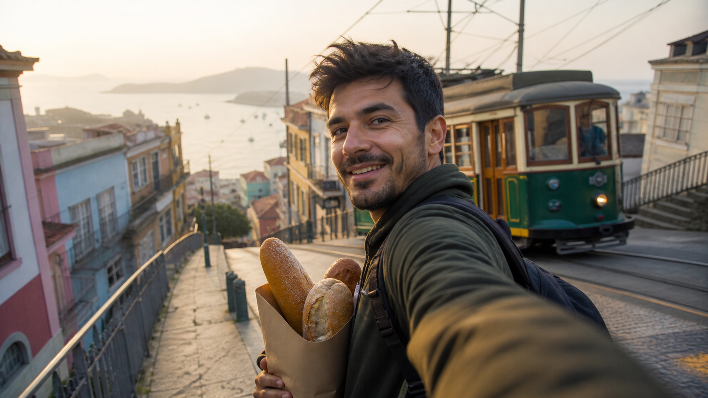

# Travel and Lifestyle Prompts for Grok Imagine 1.5



## 1. Bread at Sunrise — coastal travel vlog

**Mode:** Text-to-video · **Duration:** 10s · **Aspect ratio:** 9:16 · **Audio:** creator dialogue + street ambience

```text
Create a 10-second vertical first-person travel vlog in a fictional coastal hillside town at sunrise. A fictional adult traveler with short dark hair, olive jacket, black backpack, and a paper bag of fresh bread remains identical throughout.

0–3s — stabilized selfie view as the traveler climbs a steep pastel street; a green wooden tram approaches slowly behind on its real rails. 3–6s — they turn to reveal the sea and lift the bread bag into frame, laughing as the warm loaf nearly slips but is caught securely. 6–10s — the tram rings its bell and passes at a safe distance; the traveler says, "Best breakfast view I've found all week," then turns the camera toward the glowing harbor for a clean final view.

CAMERA: High-end smartphone, arm-length wide lens, realistic walking bounce with stabilization, exposure protects the sunrise.

PHYSICS: Bread stays in the bag, backpack straps remain on shoulders, tram follows tracks, hair and jacket respond to one light sea breeze.

AUDIO: Footsteps uphill, distant gulls, tram wheel hum and bell, paper bag rustle, exact dialogue with natural lip sync. No music.

AVOID: recognizable landmarks, unsafe proximity to tram, identity drift, extra bread, warped buildings, captions, signs, logos, watermark.
```

## 2. Lantern Market — first-person food walk

**Mode:** Text-to-video · **Duration:** 12s · **Aspect ratio:** 9:16 · **Audio:** market ambience

```text
Create a 12-second vertical first-person night-market walk in a fictional riverside city. The viewer's right hand holds a small ceramic bowl; the same woven bracelet stays on the wrist.

0–4s — move slowly beneath amber lanterns through a lively but navigable market lane; steam rises from food stalls, people pass naturally without looking at the camera. 4–8s — stop at an unbranded noodle stall; a vendor uses wooden tongs to place one crisp vegetable dumpling into the bowl. 8–12s — the viewer lifts the bowl slightly as a river ferry glides into view beyond the market; focus shifts from the dumpling to reflected lantern light on the water.

CAMERA: First-person chest height, stabilized walking movement, no selfie face, one continuous take, believable autofocus breathing.

PHYSICS: Steam drifts upward, dumpling lands and stays in bowl, liquids do not spill, crowd maintains collision-free paths.

AUDIO: Layered local conversation without intelligible phrases, sizzling pan, tongs, ceramic tap, river engine and soft horn. No narration or music.

AVOID: copied real market, national flags, readable stall names, hands changing, duplicated people, hyper-fast FPV motion, subtitles, watermark.
```

## 3. First Snow at the Hut — quiet outdoor documentary

**Mode:** Image-to-video recommended · **Duration:** 9s · **Aspect ratio:** 16:9 · **Audio:** natural ambience

```text
Animate the supplied alpine-hut reference into a 9-second quiet documentary moment. Preserve the same fictional adult hiker, rust-red shell jacket, gray wool hat, wooden hut, mountain outline, mug, and camera position.

0–3s — the hiker sits on the hut step holding a warm mug; breath is faint in cold air, and the valley remains still. 3–6s — the first sparse snowflakes begin, moving in a light crosswind; the hiker notices one flake land on the jacket sleeve and turns the wrist to inspect it. 6–9s — they look toward the mountains as a narrow sunbeam breaks through cloud, illuminating only one distant ridge; hold the contemplative profile.

CAMERA: Locked 50mm documentary composition with a nearly imperceptible push. Natural exposure, no time lapse.

PHYSICS: Snow is sparse and varied, mug steam bends with the same wind, clothing retains weight, seated anatomy stays grounded.

AUDIO: Gentle ridge wind, hut timber creak, jacket rustle, one distant raven. No speech or music.

AVOID: blizzard, avalanche, dramatic weather morph, changing mountain shape, extra hikers, logos, text, watermark.
```

## 4. Rainy Bookshop Diary — slow city lifestyle reel

**Mode:** Text-to-video · **Duration:** 10s · **Aspect ratio:** 9:16 · **Audio:** ambience + voiceover

```text
Create a 10-second vertical lifestyle diary in a small independent bookshop on a rainy afternoon. A fictional adult visitor wears a camel raincoat, round green umbrella, and canvas shoulder bag. Use generic book covers with no readable titles.

0–3s — exterior through rain-streaked glass as the visitor closes the umbrella under the awning and enters. 3–7s — interior side-tracking shot follows their fingers along a shelf; they select one plain blue book and open it near a window. 7–10s — close view of the visitor reading as a bus passes outside, casting a soft moving reflection across the glass.

VOICEOVER: "I came in to escape the rain and stayed for the quiet."

CAMERA: Intimate 35mm film look, gentle handheld movement, two soft cuts hidden by the umbrella and passing shelf edge.

PHYSICS: Wet umbrella drips downward only near the entrance; coat darkens slightly at shoulders; pages turn individually.

AUDIO: Rain, door bell, floorboard creak, page turn, muted street. Calm voiceover; no lip movement required and no music.

AVOID: readable copyrighted covers, brand signage, impossible dry umbrella, identity changes, crowds, subtitles, watermark.
```

## 5. Rooftop Breathing Break — urban wellness

**Mode:** Text-to-video · **Duration:** 8s · **Aspect ratio:** 1:1 · **Audio:** guided breath + city tone

```text
Create an 8-second square urban wellness clip at golden hour. A fictional adult office worker in a loose pale-blue shirt and dark trousers stands safely in the center of a planted rooftop garden, far from the roof edge.

0–2s — medium profile, shoulders slightly tense, distant city soft behind them. A calm off-screen guide says, "Inhale for four." 2–5s — one slow inhalation: shoulders rise only a little, chest expands naturally, nearby ornamental grass bends in a steady breeze. 5–8s — guide says, "And let it go." The person exhales, jaw unclenches, hands relax, and warm sunlight emerges from behind a cloud; end on stillness.

CAMERA: Stable waist-up 65mm view, very slow semicircle of less than 20 degrees, no cuts.

MOTION: Anatomically subtle breathing, consistent wind direction, no exaggerated meditation pose.

AUDIO: Soft city bed, leaves, distant traffic, two exact off-screen lines with measured timing. No music.

AVOID: rooftop edge danger, spiritual symbols, health claims, dramatic body movement, changing wardrobe, text, logos, watermark.
```

[Use Grok Imagine 1.5 online](https://seaimagine.com/model/grok-imagine-1-5/) · [Prompt index](README.md)
